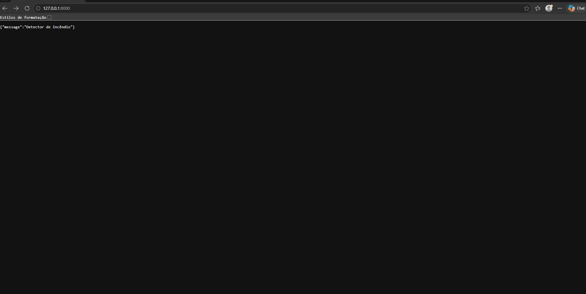

# Smoke Detection IoT API


Sistema de detecção de incêndio otimizado para sensores ambientais IoT. 
O projeto diminui a dependência de hardware de 12 para apenas 3 sensores, 
cortando custos drasticamente, enquanto mantém um desempenho de 99.7% de acurácia e 100% de recall com deploy via API REST em FastAPI.

---
## 🚀 Demo



---
## 🧠 Arquitetura e Modelagem

### 1. Seleção do Modelo
- **Baseline (Regressão Logística):** Utilizada com `QuantileTransformer` nas colunas com caudas muito extremas e `StandardScaler` 
para testar a hipótese linear, mas sofreu com a extrema multicolinearidade dos dados brutos dos sensores.
- **Modelo Final (XGBoost):** Escolhido por capturar a natureza não-linear do espalhamento de fumaça e ser naturalmente robusto a outliers e escalas heterogêneas, dispensando normalização.

### 2. Feature Selection (Redução para 3 Sensores)
A análise de importância de variáveis do XGBoost revelou que 3 sensores retêm ~94% da capacidade preditiva original:
1. `PressurehPa` (~34%)
2. `TVOCppb` (~34%)
3. `PM1.0` (~26%)

### 3. Decisões de MLOps
- **Prevenção de Data Leakage:** Estruturação com `imblearn.pipeline`.
- **Lidando com Classes Desbalanceadas:** Aplicação de `SMOTE` restrita ao conjunto de treino dentro do pipeline.
- **Resiliência de Deploy:** Integração do `SimpleImputer` no pipeline final exportado, tratando dados nulos causados por eventuais falhas físicas dos sensores.

### 4. Decisões de Negócio e Trade-offs
- **Falsos Negativos vs. Falsos Positivos:** Em detecção de incêndios, o custo de um falso negativo é muito alto. O pipeline foi otimizado para travar o **Recall em 100%** para a classe de incêndio, aceitando conscientemente uma taxa residual de Falsos Positivos (alarmes falsos preventivos) como margem de segurança.
- **Robustez da API vs. Precisão:** A injeção do `SimpleImputer` e a padronização do pipeline inteiro para `float64` causaram uma variação microscópica na fronteira de decisão da árvore. Esse trade-off foi aceito para garantir que falhas físicas no sensor IoT não causem erros no servidor em produção.

---

## 🏗️ Estrutura do Projeto

    smoke_detection/
        data/
        graficos/
        models/

        src/
            train.py
            predict.py

        utils/
            pre_processing.py

        app.py
        requirements.txt
        README.md

---

## ⚙️ Como rodar

### 1: Crie o Ambiente Virtual
Crie um ambiente virtual na pasta do projeto:
 
```bash
python -m venv .venv
```

### 2: Instale as Dependências
Instale as dependências do projeto listadas no arquivo `requirements.txt`. Escolha o comando abaixo de acordo com o seu sistema operacional:

**No Linux:**
```bash
.venv/bin/pip install -r requirements.txt
```

**No Windows:**
```bash
.venv\Scripts\pip install -r requirements.txt
```

### 3: Rodar API

```bash
uvicorn app:app --reload
```

Acesse:
http://127.0.0.1:8000/docs

---

## 🚀 Teste da API

### Endpoint

POST /predict

### Curl

```bash
curl -X POST "http://127.0.0.1:8000/predict" \
-H "Content-Type: application/json" \
-d '{
  "TVOCppb": 1200,
  "PressurehPa": 938.5,
  "PM1.0": 10.5
}'
```

### Resposta

```json
{
  "status": "alerta de incêndio",
  "classe": 1,
  "probabilidade_incendio": 99.97
}
```

---

## 💡 Melhorias futuras

- MLflow  
- Deploy online  
- Monitoramento
- Testes automatizados